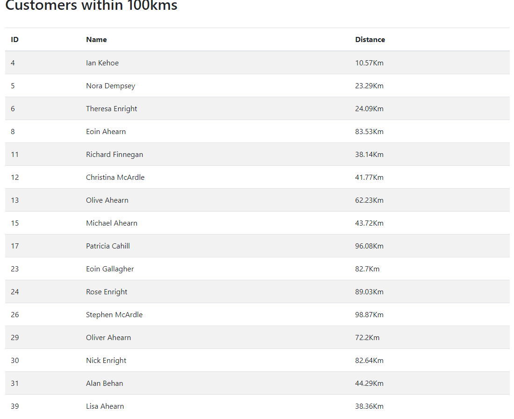

# Invite Customers for food and drinks


# Project description:

We have some customer records in a text file -- one customer per line, JSON
lines formatted. We want to invite any customer within 100km of our Dublin office for some food
and drinks on us. Write a program that will read the full list of customers and output the names
and user ids of matching customers (within 100km), sorted by User ID (ascending).

## Resources
Customer data: https://s3.amazonaws.com/intercom-take-home-test/customers.txt

The GPS coordinates for our Dublin office are 53.339428, -6.257664.

You must use the first formula from this Wikipedia article to calculate distance: https://en.wikipedia.org/wiki/Great-circle_distance


# How to run this project

##  Pre-requisities

#### Java SE Development Kit 8 (1.8.0) or newer 
Run this command in your terminal to see what version you have setup
```
javac -version
```
#### Maven 3.0 or newer 
Run this command in your terminal to see what version you have setup 
```
mvn -version
```
## Project Download
You can either 
* Download the .zip file and extract it
* Clone the project using git 

## Build the project 

* After you have unzipped / cloned the project, using your terminal navigate to its root folder (customer-invite folder)
* Now run this command:  `mvn clean install` 
* This will use Maven to download the required dependencies, and build an executable jar file in the newly created "target" folder

## Run the project 
You can now execute the project by navigating inside the target folder and running this command

`mvn spring-boot:run`

Access the url http://localhost:8080/ to see the results.



Sample Console data:
```
2021-03-29 13:16:08.826  INFO 23912 --- [nio-8080-exec-1] o.a.c.c.C.[Tomcat].[localhost].[/]       : Initializing Spring DispatcherServlet 'dispatcherServlet'
2021-03-29 13:16:08.826  INFO 23912 --- [nio-8080-exec-1] o.s.web.servlet.DispatcherServlet        : Initializing Servlet 'dispatcherServlet'
2021-03-29 13:16:08.827  INFO 23912 --- [nio-8080-exec-1] o.s.web.servlet.DispatcherServlet        : Completed initialization in 0 ms
2021-03-29 13:16:08.932  INFO 23912 --- [nio-8080-exec-4] c.c.invite.service.CustomerService       : Getting List of customers within 100.0km Range of (latitude: 53.339428, longitude: -6.257664)
2021-03-29 13:16:08.933  INFO 23912 --- [nio-8080-exec-4] c.c.invite.service.CustomerService       : Reading Customer data from https://s3.amazonaws.com/intercom-take-home-test/customers.txt
2021-03-29 13:16:10.465  INFO 23912 --- [nio-8080-exec-4] c.c.invite.service.CustomerService       : Total customers 32, of which 16 are within a 100.0km Range.
2021-03-29 13:16:10.466  INFO 23912 --- [nio-8080-exec-4] c.c.invite.service.CustomerService       : List of customers in range:
userId=4, userName='Ian Kehoe', distance=10.57Km
userId=5, userName='Nora Dempsey', distance=23.29Km
userId=6, userName='Theresa Enright', distance=24.09Km
userId=8, userName='Eoin Ahearn', distance=83.53Km
userId=11, userName='Richard Finnegan', distance=38.14Km
userId=12, userName='Christina McArdle', distance=41.77Km
userId=13, userName='Olive Ahearn', distance=62.23Km
userId=15, userName='Michael Ahearn', distance=43.72Km
userId=17, userName='Patricia Cahill', distance=96.08Km
userId=23, userName='Eoin Gallagher', distance=82.7Km
userId=24, userName='Rose Enright', distance=89.03Km
userId=26, userName='Stephen McArdle', distance=98.87Km
userId=29, userName='Oliver Ahearn', distance=72.2Km
userId=30, userName='Nick Enright', distance=82.64Km
userId=31, userName='Alan Behan', distance=44.29Km
userId=39, userName='Lisa Ahearn', distance=38.36Km


```

# What can be improved here:
* Layer Front end into component, controller, service, models.
* Add User input for changing the distance range.
* Sorting option in table.
* Add Tests for RESTClient calls.
* Add Authorization and authentication for restApis for addition of mutliple cities other than Dublin.

## Author:
Sakuntala Murugesan
dhya.san@gmail.com
